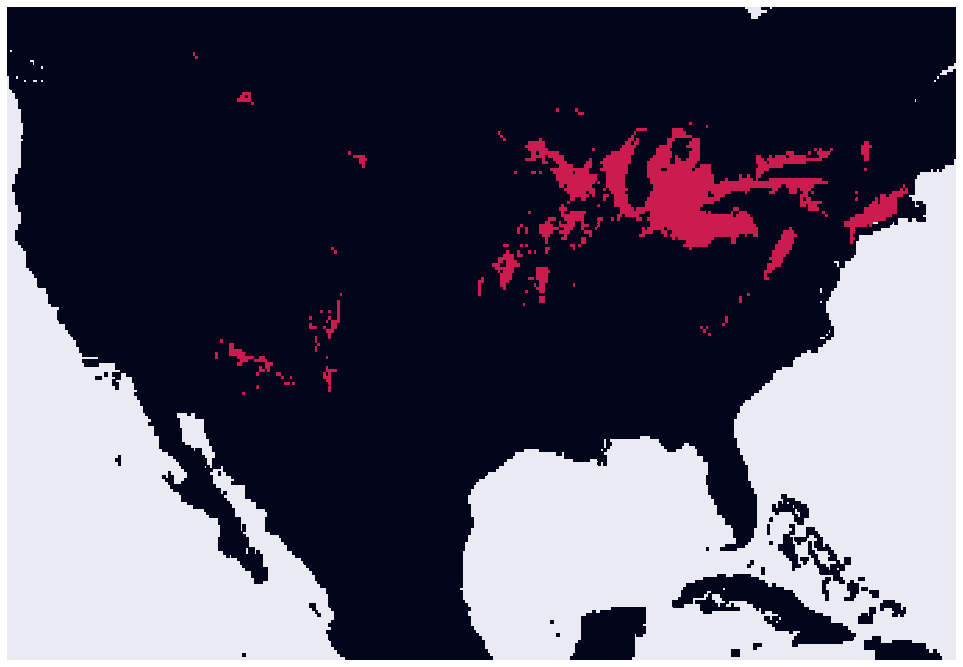

# smood

**s**imple **m**apping **o**f **o**ccurrence **d**ata: a package for making species distribution maps with Maxent.

Maxent is great, read more here:  
Steven J. Phillips, Miroslav Dudík, Robert E. Schapire. [Internet] Maxent software for modeling species niches and distributions (Version 3.4.1). Available from url: http://biodiversityinformatics.amnh.org/open_source/maxent/. Accessed on 2019-11-25.

## Installation:

`git clone https://github.com/pmckenz1/smood.git`  
`pip install smood`

## Demonstration of `smood`

### With `smood`, we just have to name 1) a species and 2) a lat/lon bounding box, and we can collect gbif observations and push them through maxent to make fun maps.


```python
import smood
```

### we can define our species and boundary right away:


```python
# define our object
mapobj = smood.Mapper(sp_name = "Monarda fistulosa",
                      lat_range=[19.0,52.0],
                      lon_range=[-125.0,-68.0])
```


```python
mapobj.profile
```


    {'spname': 'Monarda fistulosa',
     'ymin': 19.0,
     'ymax': 52.0,
     'xmin': -125.0,
     'xmax': -68.0,
     'worldclim_layers': [1,
      2,
      3,
      4,
      5,
      6,
      7,
      8,
      9,
      10,
      11,
      12,
      13,
      14,
      15,
      16,
      17,
      18,
      19]}


### we can also look at where files will be written / looked for:


```python
mapobj.maxent_path
```


    '/Users/pmckenz1/googledrive/projects/smood/bins/maxent.jar'


```python
mapobj.outputs_dir
```


    'maxent_outputs/'


```python
mapobj.worldclim_dir
```


    '/Users/pmckenz1/googledrive/projects/smood/worldclim'


### now we can use a simple `run()` function to make things go:

The `run()` function calls gbif to find all observations of the species within the bounding box, and then it runs maxent using these observations and the designated worldclim layers.

Although this writes to disk, everything that is written is then cleaned up unless you ask for it to stay with `write_outputs=True`.


```python
mapobj.run()
```

## results:

### raw png output from maxent (including occurrence data and the prediction densities)


```python
mapobj.maxent_image
```


### we can isolate the occurrence data


```python
mapobj.lons
```


    array([-87.822704, -87.893968, -88.075241, ..., -83.78194 , -81.0625  ,
           -83.19139 ])


```python
mapobj.lats
```


    array([42.39605 , 41.67832 , 40.525758, ..., 41.65722 , 39.92444 ,
           40.54833 ])


### we can also work with the density matrix


```python
smood.plot_density(density_mat=mapobj.density_mat)
```


### we can set a threshold on this matrix over which everything is considered "filled" and under which everything is considered "empty"

### start with a high threshold:


```python
smood.plot_threshold(density_mat=mapobj.density_mat, 
                     threshold=.8)
```





### now try with a lower threshold:


```python
smood.plot_threshold(density_mat=mapobj.density_mat,
                     threshold=.5)
```


